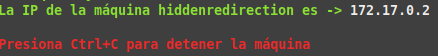
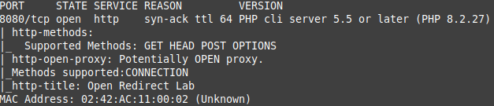
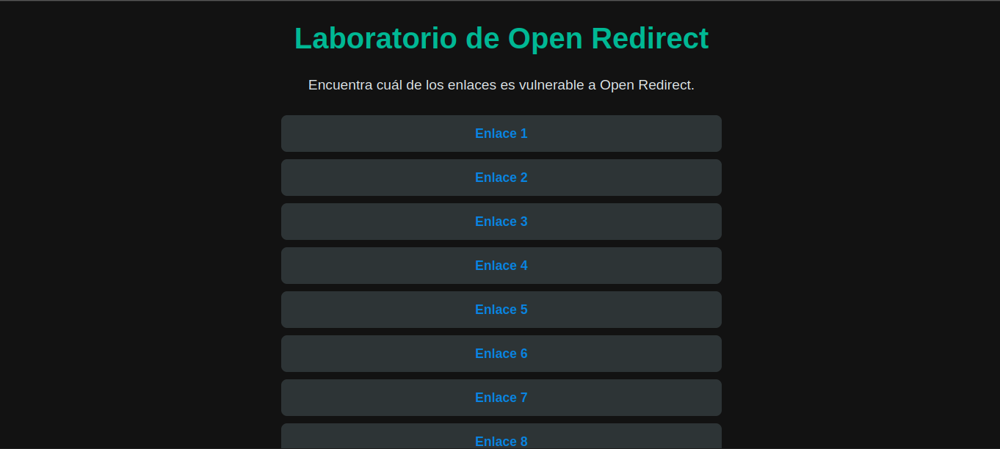
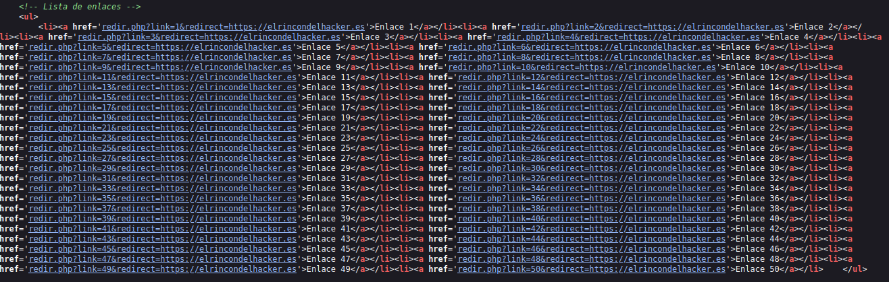

Máquina: [Hidden Redirection ](https://bugbountylabs.com/)

Autor: El Pinguino de Mario & Curiosidades De Hackers

Dificultad: Principiante


## Despliegue

Nos descargamos el archivo .zip que contiene el auto_deploy, lo descomprimimos y ejecutamos el .py como **sudo**




## Reconocimiento

Cuando la tengamos desplegada podemos ver la conectividad con ```ping -c 1 172.17.0.2``` 
<br>
con el parámetro `-c` hacemos que el ping solo se haga una vez<br>
<br>


Una vez que tengamos conectividad con la máquina usamos nmap ```nmap -p- --open -sS -sC -sV --min-rate 3000 -n -vvv -Pn 172.17.0.2``` <br>
`-p-` ⮞ comprueba todos los puertos <br>
`--open` ⮞ analiza en profundidad solo a los que esten abiertos <br>
`-sS` ⮞ para descubrir puertos de manera silenciosa y rápida <br> 
`-sC` ⮞ ejecuta los scripts de reconocimiento básico, los más comunes <br> 
`-sV` ⮞ para conocer la versión del servicio que corre por el puerto
`--min-rate 3000` ⮞ para enviar paquetes más rápido <br> 
`-n` ⮞ no aplica la resolución DNS (tarda mucho en el caso de que no pongamos dicho parámetro)<br> 
`-vvv` ⮞ cuando descubre un puerto nos lo muestra por pantalla <br> 
`-Pn` ⮞ ignora si esta activa o no la IP<br> 
<br>

Al aplicar el escaneo, vemos que el puerto 8080 está abierto
<br>


<br>

## Apache (Puerto 8080)

Al ser una máquina enfocada al bug bounty, lo normal es solo encontrar el puerto 80 que corresponde al servidor web, pero en este caso nos lo ponen más difícil usando el puerto 8080. Al buscar 172.17.0.2 no vemos nada, ya que el buscador usa el puerto 80 como predeterminado. Para poder acceder a la web necesitamos usar esta url `http://172.17.0.2:8080`. Al poner eso podremos acceder a la web.




Aquí podemos observar muchos botones (en total hay 50) que si los pulsamos nos llevan todos a `https://elrincondelhacker.es`. También podemos ver un texto que nos dice que encontremos el enlace vulnerable


Si miramos el código fuente de la página nos encontramos con esta parte que maneja la redirección




Viendo esto, podemos probar a cambiar la url a la que nos redirige el botón a por ejemplo `dockerlabs.es`. Con lo cual nos quedaría así 

Tendiendo esta url, al presionar ENTER podemos comprobar que si que funciona, redirigiéndonos a `dockerlabs.es`


## Laboratorio 2

En este laboratorio también podemos observar un botón que si lo presionamos nos redirige a google


Si miramos el código fuente el código de redirección es el mismo, pero si probamos el mismo método vemos que no funcionará. Así que habrá que probar otro método


Para hacer open-redirection también podemos probar a usar un @, que se usa para separar la url de la página principal y la atacante. Y la url final nos quedaría así


Al presionar ENTER, me sale esta confirmación (no siempre tiene porque salir). Y la damos a `Yes`


Al hacer esto, podemos ver que funciona y nos redirige a `dockerlabs.es`


## Laboratorio 3

En este laboratorio la estructura es la misma que los otros dos, un botón que nos redirige a google


Si probamos a cambiar la url o usamos el @ nos dará este error


Para estos casos podemos utilizar oralyzer, una herramienta para detectar vulnerabilidades de open-redirect pasándole una url como input. Es este caso usaremos esta url `http://172.17.0.2/laboratorio3/redirect.php?url=https://www.google.com`


Al ejecutar el comando vemos que detecta varias url con las que se puede explotar el open-redirect. Pero como todas redirigen a google pues no podemos saber si en realidad funciona, ya que el laboratorio da como válido todos los enlaces que redirijan a google. Así que probaremos esta url `http://172.17.0.2/laboratorio3/redirect.php?url=http%3A%2F%2Fwww.dev.google.com`.

Al utilizar esa url podemos ver que nos redirige a `www.dev.google.com`, aunque este dominio no exista, podemos ver que la web es vulnerable a un open-redirect


## Y CON ESTO YA LO RESOLVERÍAMOS 😉
