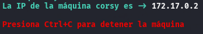
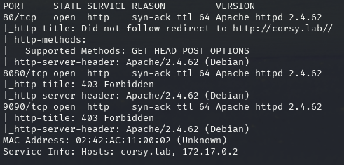
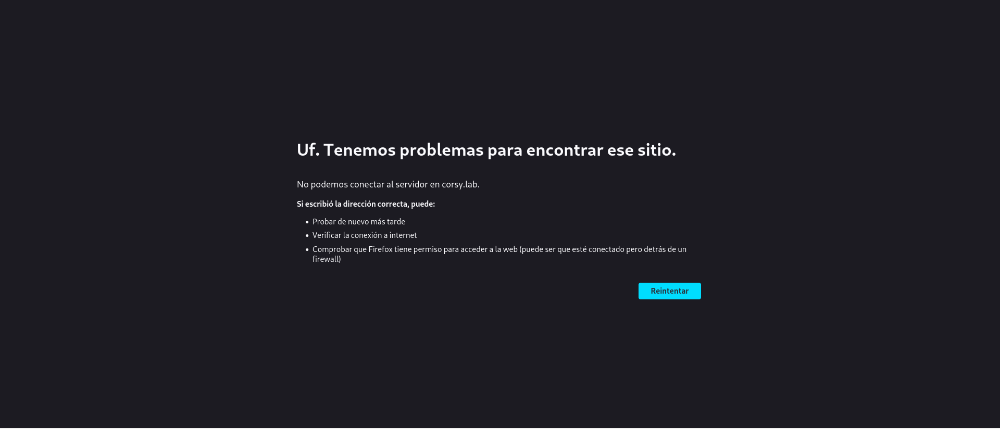
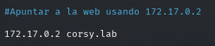
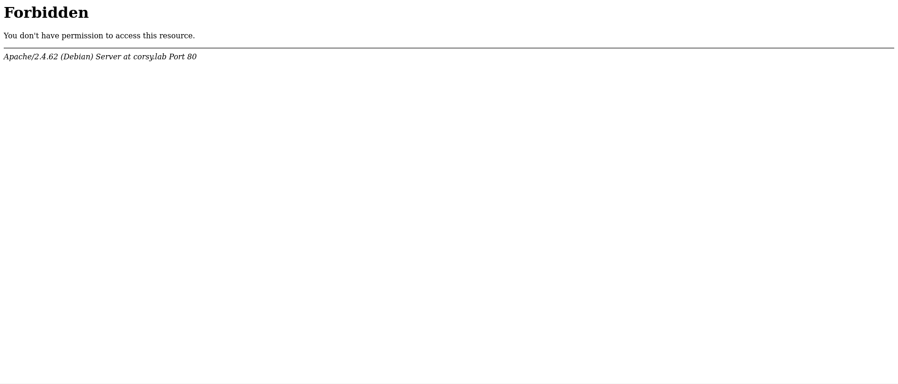

Máquina: [Corsy](https://bugbountylabs.com/)

Autor: El Pinguino de Mario & Curiosidades De Hackers

Dificultad: Avanzado


## Despliegue

Nos descargamos el archivo .zip que contiene el auto_deploy, lo descomprimimos y ejecutamos el .py como **sudo**




## Reconocimiento

Cuando la tengamos desplegada podemos ver la conectividad con ```ping -c 1 172.17.0.2``` 
<br>
con el parámetro `-c` hacemos que el ping solo se haga una vez<br>
<br>


Una vez que tengamos conectividad con la máquina usamos nmap ```nmap -p- --open -sS -sC -sV --min-rate 3000 -n -vvv -Pn 172.17.0.2``` <br>
`-p-` ⮞ comprueba todos los puertos <br>
`--open` ⮞ analiza en profundidad solo a los que esten abiertos <br>
`-sS` ⮞ para descubrir puertos de manera silenciosa y rápida <br> 
`-sC` ⮞ ejecuta los scripts de reconocimiento básico, los más comunes <br> 
`-sV` ⮞ para conocer la versión del servicio que corre por el puerto
`--min-rate 3000` ⮞ para enviar paquetes más rápido <br> 
`-n` ⮞ no aplica la resolución DNS (tarda mucho en el caso de que no pongamos dicho parámetro)<br> 
`-vvv` ⮞ cuando descubre un puerto nos lo muestra por pantalla <br> 
`-Pn` ⮞ ignora si esta activa o no la IP<br> 
<br>

Al aplicar el escaneo, vemos que los puertos 80, 8080 y 9090 está abiertos
<br>


<br>

## Apache (Puerto 80)

En el contexto de una máquina orientada al bug bounty, lo más común es encontrar el puerto 80 abierto, ya que este es el puerto estándar para los servidores web.

## Servidor web (Puerto 8080)

El puerto 8080 es una alternativa al puerto 80. Se utiliza en situaciones donde el puerto 80 está ocupado o no se desea utilizar por alguna razón. A menudo, es usado por servidores web adicionales o aplicaciones que requieren un puerto distinto.

## Aplicaciones de administración (Puerto 9090)

Este puerto es comúnmente utilizado por aplicaciones de administración, especialmente para interfaces web que permiten gestionar servicios o recursos de un servidor. Se utiliza con frecuencia en herramientas de monitoreo de redes, paneles de control o para la administración de servidores y aplicaciones específicas.

Cada puerto corresponde a un laboratorio conde tenemos que explotar la vulnerabilidad CORS (Cross-Origin Resource Sharing), esta surge cuando la configuración del servidor no restringe adecuadamente los orígenes permitidos, lo que puede llevar a filtraciones de datos sensibles y a la explotación de APIs. Es importante configurar CORS de manera cuidadosa y restringir el acceso solo a orígenes confiables.

# Laboratorio 1

Para acceder a este laboratorio ponemos en el navegador `http://172.17.0.2`, y al buscarlo nos encontramos con esto



Como vemos nos redirige a `corsy.lab` pero nos da un error de que no se puede conectar al servidor. Para arreglarlo podemos entrar al archivo /etc/host con `sudo nano /etc/hosts` y al final del archivo ponemos esto



Al hacer eso cuardamos el archivo con `Ctrl+X` y `Ctrl+O` y volvemos a entrar a `http://172.17.0.2`. Esta vez nos aparece algo diferente



Esto nos indica que se nos está bloqueando la conexión y que no podemos acceder, pero podemos intentar bypassear esto con **curl** para ahcerle creer a la web que somos corsy.lab, para esto ejecutaremos `curl http://corsy.lab -H "Origin: http://corsy.lab" -o web.html`

`curl` ⮞ Comando principal. Es la herramienta de línea de comandos utilizada para realizar solicitudes HTTP y recibir respuestas de servidores web.

`http://corsy.lab` ⮞ URL de destino. Es la dirección a la que curl hace la solicitud. En este caso, es http://corsy.lab.

`-H "Origin: http://corsy.lab"` ⮞ Encabezado HTTP personalizado. La opción -H agrega un encabezado a la solicitud HTTP. Aquí, el encabezado Origin: http://corsy.lab indica al servidor que la solicitud proviene de esta URL, lo cual es útil en situaciones de CORS (Cross-Origin Resource Sharing).

`-o web.htm`l ⮞ Especificar nombre de archivo de salida. La opción -o permite definir el nombre con el que deseas guardar el archivo descargado. En este caso, el archivo se guardará como web.html en lugar de usar el nombre que el servidor podría haber sugerido.


En este laboratorio nos encontramos una web con una foto y don botones, uno register y otro de login. Vamos a darle al de register


Vamos a probar a registrarnos en esta web por si más adelante podemos encontrar algo interesante, en este caso yo lo rellené con estos datos: usuario: test, correo: test@test.com y contraseña: 123123


Al acabar de registrarnos nos lleva automáticamente al apartado del login


Este lo completaremos con los datos que usamos en el registro


Cuando nos logueemos nos llevará a este panel para introducir datos de un perro para participar en la competición


En este panel rellenaremos en nombre del perro y breed (raza del perro) con el mismo payload que utilizamos antes: `"><svg onload=alert(1)//` y los otros 2 parámetros con lo que nos pide (en la edad un número y en la url de la imagen pues una url de imagen cualquiera). Así es como me quedó a mí.


Con todos los datos listos podemos darle a "Add dog", y al hacer esto vemos que el payload que usamos funciona y conseguimos vulnerar la web otra vez.


## Y CON ESTO YA LO RESOLVERÍAMOS 😉
