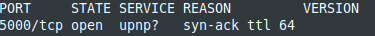
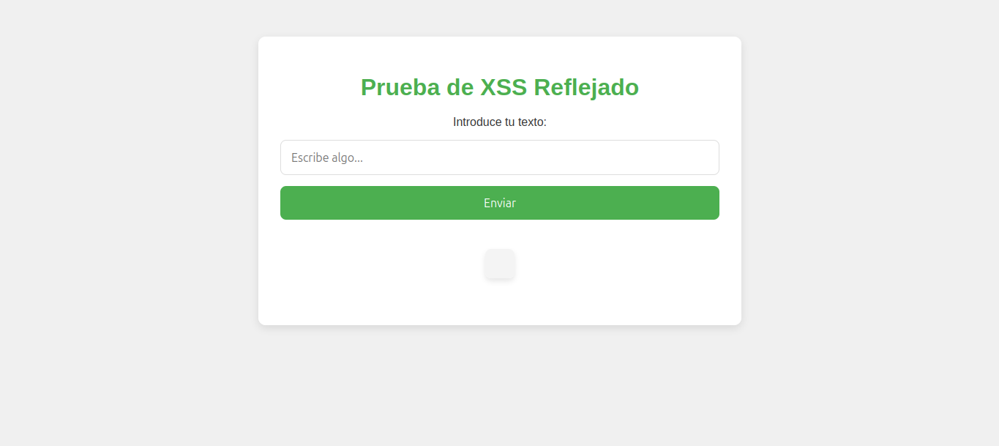
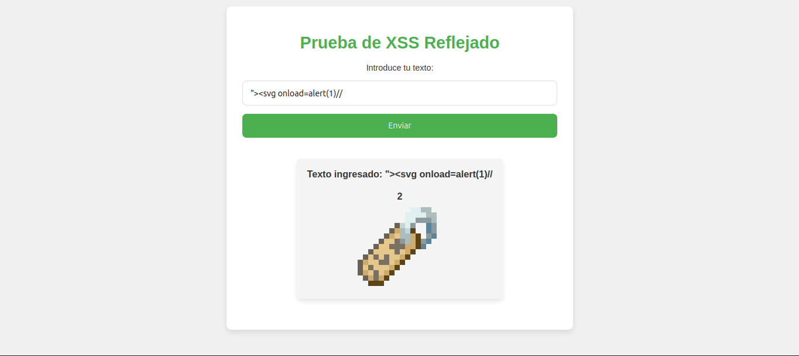

Máquina: [Curiosity](https://bugbountylabs.com/)

Autor: Santitub

Dificultad: Principiante


## Despliegue

Nos descargamos el archivo .zip que contiene el auto_deploy, lo descomprimimos y ejecutamos el .py como **sudo**


## Reconocimiento

Cuando la tengamos desplegada podemos ver la conectividad con ```ping -c 1 172.17.0.2``` 
<br>
con el parámetro `-c` hacemos que el ping solo se haga una vez<br>
<br>


Una vez que tengamos conectividad con la máquina usamos nmap ```nmap -p- --open -sS -sC -sV --min-rate 3000 -n -vvv -Pn 172.17.0.2``` <br>
`-p-` ⮞ comprueba todos los puertos <br>
`--open` ⮞ analiza en profundidad solo a los que esten abiertos <br>
`-sS` ⮞ para descubrir puertos de manera silenciosa y rápida <br> 
`-sC` ⮞ ejecuta los scripts de reconocimiento básico, los más comunes <br> 
`-sV` ⮞ para conocer la versión del servicio que corre por el puerto
`--min-rate 3000` ⮞ para enviar paquetes más rápido <br> 
`-n` ⮞ no aplica la resolución DNS (tarda mucho en el caso de que no pongamos dicho parámetro)<br> 
`-vvv` ⮞ cuando descubre un puerto nos lo muestra por pantalla <br> 
`-Pn` ⮞ ignora si esta activa o no la IP<br> 
<br>

Al aplicar el escaneo, vemos que el puerto 5000 está abierto
<br>


<br>

## Flask (Puerto 5000)

En esta máquina podemos encontrar el puerto 5000 abierto, este se usa para aplicaciones flask dentro de python. Al buscar 172.17.0.2 no vemos nada, ya que el buscador usa el puerto 80 como predeterminado. Para poder acceder a la web necesitamos usar esta url `http://172.17.0.2:5000`. Al poner eso podremos acceder a la web.




En la web nos encontramos con un campo para ingresar texto en el que nos piden que ingresemos un texto y un botón de enviar. Podemos probar payloads de esta [url](https://github.com/payloadbox/xss-payload-list/blob/master/Intruder/xss-payload-list.txt)


Por ejemplo podemos probar el payload `"><svg onload=alert(1)//`, este payload utliza `">` al inicio, ya que esto le indica a la web que se cerró la etiqueta enterior (la del campo de texto) y el resto del comando le indica que estamos añadiendo algo aparte.

Si probamos este payload vemos que no funciona, pero vemos que ha aparecido algo en la web.




## Y CON ESTO YA LO RESOLVERÍAMOS 😉
