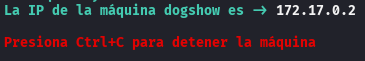
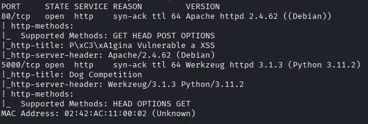
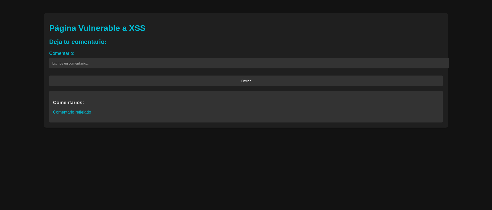
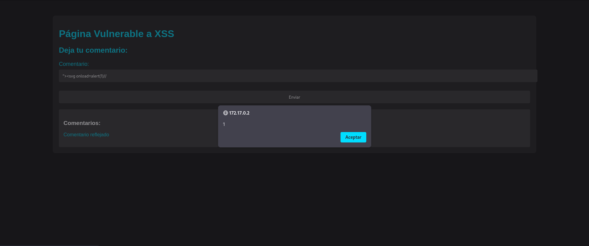
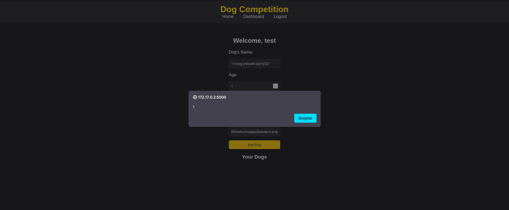

Máquina: [DogShow](https://bugbountylabs.com/)

Autor: El Pinguino de Mario & Curiosidades De Hackers

Dificultad: Avanzado


## Despliegue

Nos descargamos el archivo .zip que contiene el auto_deploy, lo descomprimimos y ejecutamos el .py como **sudo**




## Reconocimiento

Cuando la tengamos desplegada podemos ver la conectividad con ```ping -c 1 172.17.0.2``` 
<br>
con el parámetro `-c` hacemos que el ping solo se haga una vez<br>
<br>


Una vez que tengamos conectividad con la máquina usamos nmap ```nmap -p- --open -sS -sC -sV --min-rate 3000 -n -vvv -Pn 172.17.0.2``` <br>
`-p-` ⮞ comprueba todos los puertos <br>
`--open` ⮞ analiza en profundidad solo a los que esten abiertos <br>
`-sS` ⮞ para descubrir puertos de manera silenciosa y rápida <br> 
`-sC` ⮞ ejecuta los scripts de reconocimiento básico, los más comunes <br> 
`-sV` ⮞ para conocer la versión del servicio que corre por el puerto
`--min-rate 3000` ⮞ para enviar paquetes más rápido <br> 
`-n` ⮞ no aplica la resolución DNS (tarda mucho en el caso de que no pongamos dicho parámetro)<br> 
`-vvv` ⮞ cuando descubre un puerto nos lo muestra por pantalla <br> 
`-Pn` ⮞ ignora si esta activa o no la IP<br> 
<br>

Al aplicar el escaneo, vemos que los puertos 80 y 5000 está abiertos
<br>


<br>

## Apache (Puerto 80)

Al ser una máquina enfocada al bug bounty, lo normal es solo encontrar el puerto 80 que corresponde al servidor web. Al buscar 172.17.0.2 nos encontramos con esto



En esta web hay un campo para insertar texto , un botón de enviar y un título diciéndonos que es vulnerable a xss.

Para probar payloads podemos entrar en esta [url](https://github.com/payloadbox/xss-payload-list/blob/master/Intruder/xss-payload-list.txt)

En este caso, probaremos el payload `"><svg onload=alert(1)//`, ya que utliza `">` al inicio, ya que esto le indica a la web que se cerró la etiqueta enterior (la del campo de texto) y el resto del comando le indica que estamos añadiendo algo aparte.

Al probar este payload vemos que funciona perfectamente, pero aún no hemos acabado, ya que vimos antes que el puerto 5000 estaba abierto




## Flask (Puerto 5000)

En esta máquina podemos encontrar el puerto 5000 abierto, este se usa para aplicaciones flask dentro de python. Para poder acceder a la web necesitamos usar esta url `http://172.17.0.2:5000`. Al poner eso podremos acceder a la web.


En este laboratorio nos encontramos una web con una foto y don botones, uno re register y otro de login


Si probamos este payload vemos que funciona perfectamente




## Y CON ESTO YA LO RESOLVERÍAMOS 😉
