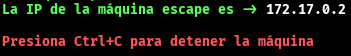
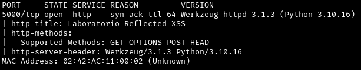
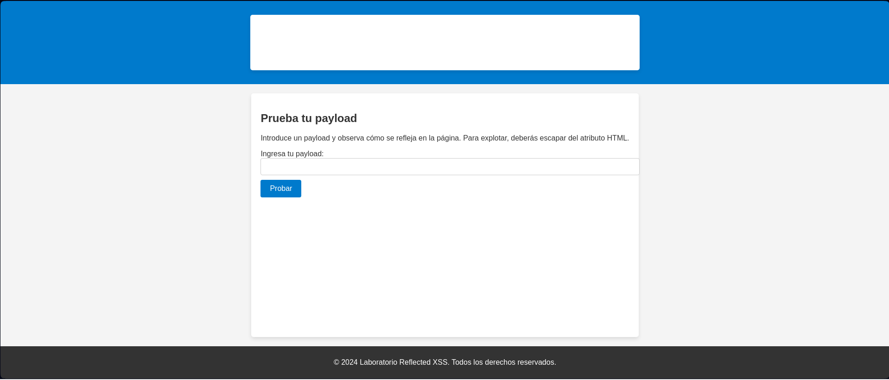

Máquina: [Hidden Redirection](https://bugbountylabs.com/)

Autor: El Pinguino de Mario & Curiosidades De Hackers

Dificultad: Principiante


## Despliegue

Nos descargamos el archivo .zip que contiene el auto_deploy, lo descomprimimos y ejecutamos el .py como **sudo**




## Reconocimiento

Cuando la tengamos desplegada podemos ver la conectividad con ```ping -c 1 172.17.0.2``` 
<br>
con el parámetro `-c` hacemos que el ping solo se haga una vez<br>
<br>


Una vez que tengamos conectividad con la máquina usamos nmap ```nmap -p- --open -sS -sC -sV --min-rate 3000 -n -vvv -Pn 172.17.0.2``` <br>
`-p-` ⮞ comprueba todos los puertos <br>
`--open` ⮞ analiza en profundidad solo a los que esten abiertos <br>
`-sS` ⮞ para descubrir puertos de manera silenciosa y rápida <br> 
`-sC` ⮞ ejecuta los scripts de reconocimiento básico, los más comunes <br> 
`-sV` ⮞ para conocer la versión del servicio que corre por el puerto
`--min-rate 3000` ⮞ para enviar paquetes más rápido <br> 
`-n` ⮞ no aplica la resolución DNS (tarda mucho en el caso de que no pongamos dicho parámetro)<br> 
`-vvv` ⮞ cuando descubre un puerto nos lo muestra por pantalla <br> 
`-Pn` ⮞ ignora si esta activa o no la IP<br> 
<br>

Al aplicar el escaneo, vemos que el puerto 8080 está abierto
<br>


<br>

## Flask (Puerto 5000)

En esta máquina podemos encontrar el puerto 5000 abierto, este se usa para aplicaciones flask dentro de python. Al buscar 172.17.0.2 no vemos nada, ya que el buscador usa el puerto 80 como predeterminado. Para poder acceder a la web necesitamos usar esta url `http://172.17.0.2:5000`. Al poner eso podremos acceder a la web.




Aquí podemos observar muchos botones (en total hay 50) que si los pulsamos nos llevan todos a `https://elrincondelhacker.es`. También podemos ver un texto que nos dice que encontremos el enlace vulnerable


Si miramos el código fuente de la página nos encontramos con esta parte en la que están todas las url


Viendo esto, podemos usar este [script](https://github.com/Santitub/Bountyscripts/blob/main/lista.py) para enumerar todos los enlaces y guardarlos en un txt

Una vez guardados los enlaces podemos ver cual es válido con este otro [script](https://github.com/Santitub/Bountyscripts/blob/main/links.py)

Al utilizarlo vemos este resultado


Al probar esa url vemos que nos redirige a `dockerlabs.es` (podemos probar cualquier url)


## Y CON ESTO YA LO RESOLVERÍAMOS 😉
