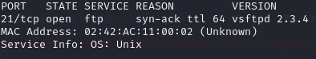
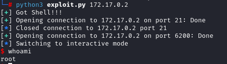

Máquina: [FirstHacking](https://dockerlabs.es/)

Autor: El Pingüino de Mario

Dificultad: Muy fácil

## Despliegue

Primero desplegamos la máquina con ```sudo bash auto_deploy.sh firsthacking.tar```(si no sabes hacerlo puedes consultar este [pdf](https://dockerlabs.es/instrucciones_de_uso.pdf)).


## Reconocimiento

Cuando la tengamos desplegada podemos ver la conectividad con ```ping -c 1 172.17.0.2``` 
<br>
con el parámetro `-c` hacemos que el ping solo se haga una vez<br>
<br>


Una vez que tengamos conectividad con la máquina usamos nmap ```nmap -p- --open -sS -sC -sV --min-rate 3000 -n -vvv -Pn 172.17.0.2``` <br>
`-p-` ⮞ comprueba todos los puertos <br>
`--open` ⮞ analiza en profundidad solo a los que esten abiertos <br>
`-sS` ⮞ para descubrir puertos de manera silenciosa y rápida <br> 
`-sC` ⮞ ejecuta los scripts de reconocimiento básico, los más comunes <br> 
`-sV` ⮞ para conocer la versión del servicio que corre por el puerto
`--min-rate 3000` ⮞ para enviar paquetes más rápido <br> 
`-n` ⮞ no aplica la resolución DNS (tarda mucho en el caso de que no pongamos dicho parámetro)<br> 
`-vvv` ⮞ cuando descubre un puerto nos lo muestra por pantalla <br> 
`-Pn` ⮞ ignora si esta activa o no la IP<br> 
<br>

Al aplicar el escaneo, vemos que el puerto 21 está abierto
<br>


<br>

## FTP (Puerto 21)

Una vez que obtengamos la versión del ftp probamos a buscar `ftp vsftpd 2.3.4 exploit github`. en internet para encontrar algo que nos ayude a explotar esa vulnerabilidad. Al buscarlo encontramos este [repositorio](https://github.com/Hellsender01/vsftpd_2.3.4_Exploit). 
Ahora procederemos a clonarlo con `git clone https://github.com/Hellsender01/vsftpd_2.3.4_Exploit.git`.
Una vez que lo descarguemos instalaremos las dependencias necesarias con `sudo python3 -m pip install pwntools` y cuando estén instaladas ejecutamos `python3 exploit.py 172.17.0.2`. 
Y con eso conseguiríamos ser el usuario **root**


